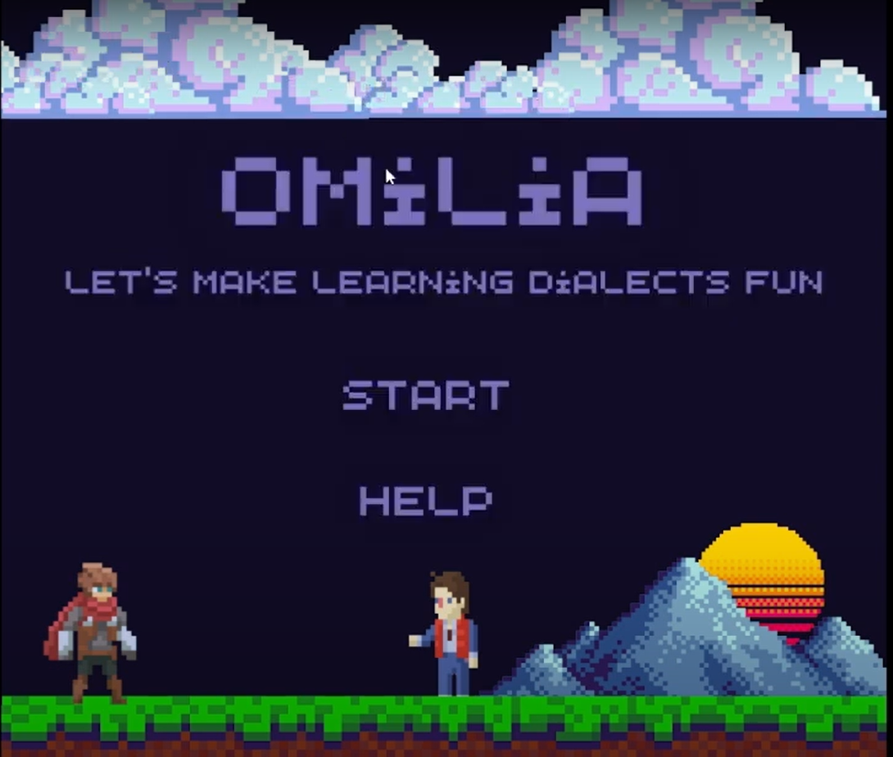
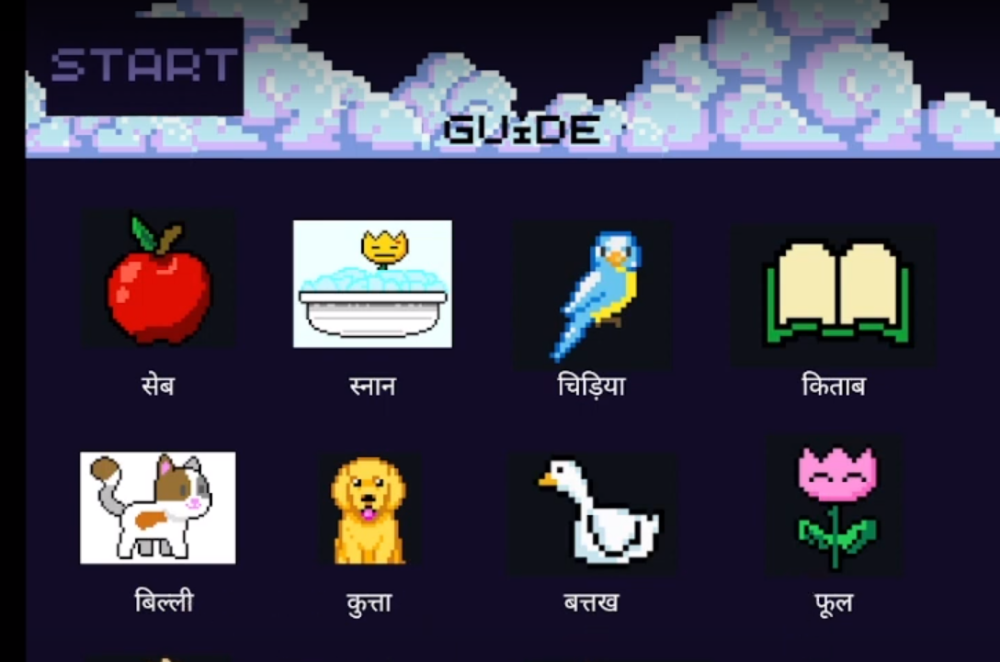
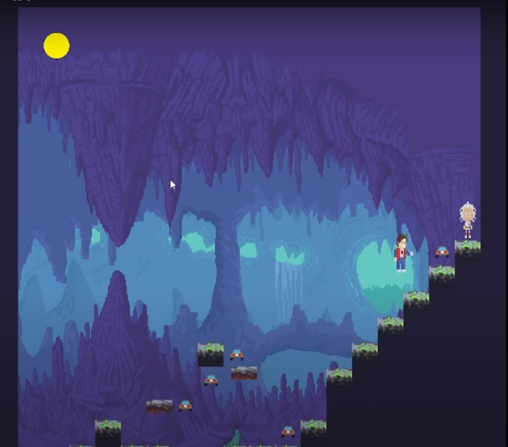
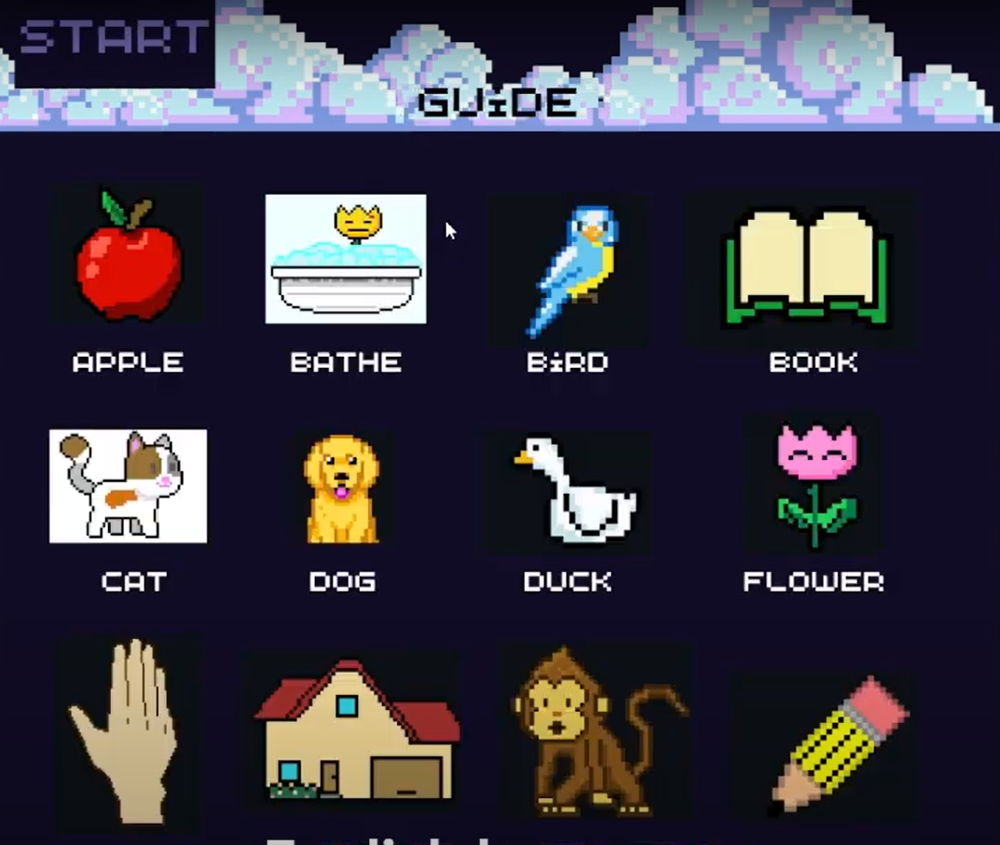
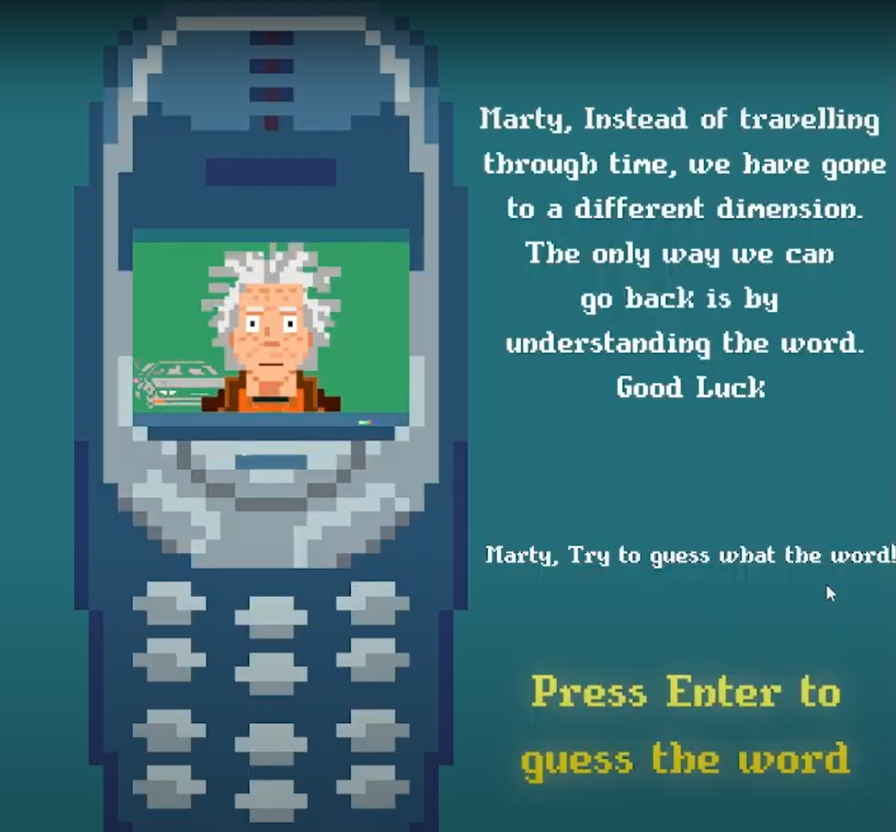

# Omilia
## Promoting fun learning with Omilia
Omilia is a retro-themed game inspired from platform games popular in the 90s with an added feature which makes it an educational game.This feature involves a set of questions in different languages which are asked after the player completes each level. TO move to the next level the player must give the right answer.

## Demo
Link to the youtube video demo : https://www.youtube.com/watch?v=9ukLw9uVfgc
## Table of contents
* [General info](#general-info)
* [Technologies](#technologies)
* [Usage](#Usage)
* [Project Status](#ProjectStatus)
* [Contributors](#Contributors)
## General info
This project is a part of the OSDC'23 Hackathon.
**Problem Statement:
To promote learning languages (specially local indian languages) in a fun and interactive way.
**How we plan to solve it:
Through Omilia, children will learn basic words of a certain language (as per the mode of the game) while also enjoying the game due to a colorful interface.
### Pictures:

## Technologies
Project is created with:
* Python
* Pygame
## Usage
* One can install the dependencies using the command:
$ pip install pygame
* This project code can be executed using any python interpreter for example pycharm.
* Make sure your display window is set to appropriate dimensions (display scale should be 100 %) for the game display window to fit the screen.

## Project Status
The project is still under development as there are various indian languages yet to be included.
We are also striving to include various updates and improvements for faster and more effective learning.
## Room for Improvement
We aim to improve our project by implementing the following features:
1. Try to build an app interface to make this technology more accessible.
2. Try to include less appreciated indian dialects.

## Contributors
* Soham Kukreti
* Yuvraj Rathi
* Satyam Rathi
* Sanvi Sharma
